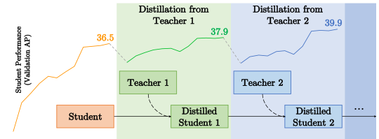
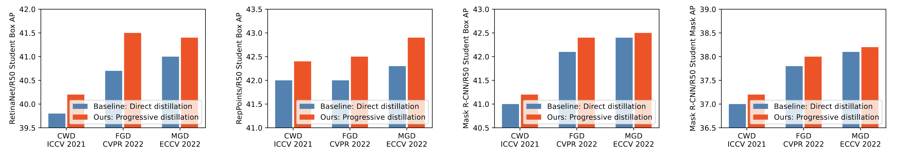

# MTPD: Learning Lightweight Object Detectors via Multi-Teacher Progressive Distillation

This is the official PyTorch implementation of our *ICML 2023* paper:

**[Learning Lightweight Object Detectors via Multi-Teacher Progressive Distillation](https://arxiv.org/abs/2308.09105)**

[Shengcao Cao](https://shengcao-cao.github.io/), [Mengtian Li](https://mtli.github.io/), [James Hays](https://faculty.cc.gatech.edu/~hays/), [Deva Ramanan](https://www.cs.cmu.edu/~deva/), [Yu-Xiong Wang](https://yxw.web.illinois.edu/), [Liang-Yan Gui](https://cs.illinois.edu/about/people/faculty/lgui)





## Environment Setup

If you just want to test and use our distilled student detector models, installing MMDetection is enough. Our code and experiments were developed based on [MMDetection v2.19.0](https://github.com/open-mmlab/mmdetection/blob/v2.19.0/docs/get_started.md), but newer versions should also be compatible.

If you want to train student models with MTPD + MGD, please first check the original documentation of [MGD](https://github.com/yzd-v/MGD/tree/master/det) for its environment setup, and then add our new code from `mtpd_mgd` to MMDetection.

## Model Weights

Here we list the model weights for the best results included in our paper:

| Student              | Teachers                                                     | Student Performance (Box AP / Mask AP) | Weights                                                      |
| -------------------- | ------------------------------------------------------------ | -------------------------------------- | ------------------------------------------------------------ |
| RetinaNet/ResNet-50  | Retinanet/ResNet-101 -> RetinaNet/ResNeXt-101                | 41.7                                   | [link](https://drive.google.com/file/d/1o_PthxoRJig9W8BZyYqB90R31GIHKAzj/view?usp=sharing) |
| RetinaNet/ResNet-50  | Retinanet/Swin-T -> Retinanet/Swin-S                         | 42.0                                   | [link](https://drive.google.com/file/d/13gWelcDaH2f-Atevy74bXIBV5FKNDnGD/view?usp=sharing) |
| Mask R-CNN/ResNet-50 | Cascade Mask R-CNN/ResNet-50-DCN -> Cascade Mask R-CNN/ResNeXt-101-DCN | 42.5 / 38.2                            | [link](https://drive.google.com/file/d/1tPTfe7v_9QmNFbVPoHLOMRh88a8BAuWq/view?usp=sharing) |
| Mask R-CNN/ResNet-50 | Mask R-CNN/Swin-T -> Mask R-CNN/Swin-S                       | 42.6 / 38.4                            | [link](https://drive.google.com/file/d/1GJM7Imh7KXSSx-WJW8LkiwaxS6zgB7FT/view?usp=sharing) |
| RepPoints/ResNet-50  | RepPoints/ResNet-101 -> RepPoints/ResNeXt-101-DCN            | 42.9                                   | [link](https://drive.google.com/file/d/1QA1yM67eD_ZtS7wdpTSZSeHg_vPNfg5J/view?usp=sharing) |

## Usage

### Testing Existing Models

You may use the original tool scripts and configuration files from MMDetection to test our distilled student detector models. For example, to evaluate a RetinaNet student with 8 GPUs, run:

```bash
bash tools/dist_test.sh \
    configs/retinanet/retinanet_r50_fpn_1x_coco.py \
    /path/to/weights/retinanet_r50-swint-swins.pth \
    8 \
    --work-dir /path/to/eval/retinanet_r50-swint-swins \
    --eval bbox
```

To evaluate a Mask R-CNN student, run:

```bash
bash tools/dist_test.sh \
    configs/mask_rcnn/mask_rcnn_r50_fpn_1x_coco.py \
    /path/to/weights/mask_rcnn_r50-swint-swins.pth \
    8 \
    --work-dir /path/to/eval/mask_rcnn_r50-swint-swins \
    --eval bbox segm
```

### Training with MTPD

Here is an example for distilling RetinaNet/ResNet-50 student with Retinanet/ResNet-101 -> RetinaNet/ResNeXt-101 teachers:

```bash
# activate MGD environment
conda activate mgd

# distill with the first teacher RetinaNet/ResNet-101
bash tools/dist_train.sh \
    configs/distillers/mgd/retinanet/retina_r101_distill_retina_r50_fpn_1x_coco.py \
    8 \
    --work-dir save/retinanet/retina_r101_distill_retina_r50_fpn_1x_coco

# convert the checkpoint to student-only weights
python tools/pth_transfer.py --mgd_path save/retinanet/retina_r101_distill_retina_r50_fpn_1x_coco/latest.pth --output_path save/retinanet/retina_r101_distill_retina_r50_fpn_1x_coco/student.pth

# distill with the second teacher RetinaNet/ResNeXt-101
# we need to set the student weights from the previous step, and prevent the student from being initialized with the teacher weights
bash tools/dist_train.sh \
    configs/distillers/mgd/retinanet/retina_rx101_64x4d_distill_retina_r50_fpn_1x_coco.py \
    8 \
    --work-dir save/retinanet/retina_rx101_64x4d_distill_retina_r50_fpn_1x_coco \
    --cfg-options distiller.student_pretrained="save/retinanet/retina_r101_distill_retina_r50_fpn_1x_coco/student.pth" \
    distiller.init_student=False
```

## Citation

If you use our method, code, or results in your research, please consider citing our paper:

```BibTeX
@inproceedings{cao2023learning,
  title={Learning Lightweight Object Detectors via Multi-Teacher Progressive Distillation},
  author={Cao, Shengcao and Li, Mengtian and Hays, James and Ramanan, Deva and Wang, Yu-Xiong and Gui, Liangyan},
  booktitle={Proceedings of the 40th International Conference on Machine Learning},
  pages={3577--3598},
  year={2023}
}
```

## License

This project is released under the [Apache 2.0 license](./LICENSE). Other codes from open source repository follows the original distributive licenses.
